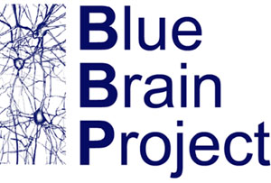

[TOC]

# Introduction {#Introduction}

Welcome to Brion, a C++ project for read and write access to Blue Brain data
structures, including BlueConfig/CircuitConfig, Circuit, CompartmentReport,
Mesh, Morphology, Synapse and Target files.

Brion can be retrieved by cloning the
[source code](https://github.com/BlueBrain/Brion.git).
The [latest API documentation]
(http://bluebrain.github.io/Brion-1.9/index.html) can be found on
[bluebrain.github.io](http://bluebrain.github.io).
Additional documentation exists for the [Python wrapping of Brain]
(python/index.html).

To keep track of the changes between releases check the [changelog](@ref Changelog).

# Features {#Features}

Brion provides two libraries Brion and Brain. The former is a collection of file
readers and writers intended for low level access to the data model. The latter
is a set of higher level classes that wrap low level data objects with a
use-case oriented API.

## IO library

This is the core library provided by Brion. It includes classes for reading
and writing files which store the Blue Brain data model.

* Fast and low-overhead read access to:
  * Blue configs (brion::BlueConfig)
  * Circuit description (brion::Circuit)
  * H5 Synapses data (brion::SynapseSummary, brion::Synapse)
  * Target (brion::Target)
  * BBP binary meshes (brion::Mesh)
  * BBP H5 morphologies and SWC morphologies (brion::Morphology)
  * Compartment reports (brion::CompartmentReport)
  * Spike reports (brion::SpikeReport)
* Fast and low-overhead write access to:
  * Compartment reports (brion::CompartmentReport)
  * BBP binary meshes (brion::Mesh)
  * BBP H5 morphologies (brion::Morphology)
  * Spike reports (brion::SpikeReport)
* Basic [data types](@ref brion/types.h) to work with the loaded data using
  [Boost](http://www.boost.org/doc/libs),
  [Lunchbox](http://eyescale.github.io/Lunchbox-1.14/index.html),
  [vmmlib](http://eyescale.github.io/vmmlib-1.12/index.html).

## High level library

The higher level library is called Brain and it provides:

* brain::Circuit to facilitate loading information about cells, morphologies (in
  local and global circuit coordinates) and synapses.
* brain::neuron::Morphology with higher level functions to deal with
  morphologies.
* brain::Synapses and brain::Synapse for array and object access to synapses.

# Building {#Building}

Brion is a cross-platform library, designed to run on any modern operating
system, including all Unix variants. Brion uses CMake to create a
platform-specific build environment. The following platforms and build
environments are tested:

* Linux: Ubuntu 14.04 & 16.04 and RHEL 6 (Makefile, i386, x64)

Building from source is as simple as:

    git clone https://github.com/BlueBrain/Brion.git
    mkdir Brion/build
    cd Brion/build
    cmake ..
    make
