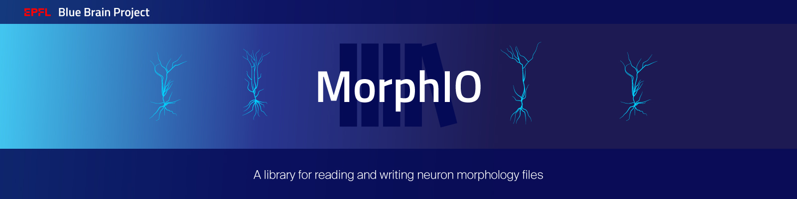

|license| |docs|

MorphIO
=======

Documentation
-------------

MorphIO documentation is built and hosted on `readthedocs <http://morphio.readthedocs.org/>`_.

* `latest snapshot <http://morphio.readthedocs.org/en/latest/>`_
* `latest release <http://morphio.readthedocs.org/en/stable/>`_

Introduction
------------

MorphIO is a library for reading and writing neuron morphology files. It supports the following
formats:

* SWC
* ASC (aka. neurolucida)
* H5 v1
* H5 v2 is not supported anymore, see `H5v2`_

It provides 3 C++ classes that are the starting point of every morphology analysis:

* ``Soma``: contains the information related to the soma.

* ``Section``: a section is the succession of points between two bifurcations. To the bare minimum
  the ``Section`` object will contain the section type, the position and diameter of each point.

* ``Morphology``: the morphology object contains general information about the loaded cell
  but also provides accessors to the different sections.

One important concept is that MorphIO is split into a *read-only* part and a *read/write* one.

H5v2
====

Starting at version 2.6.0, the file format ``h5v2`` is no longer supported. If you have
morphologies in this format, you can convert them to h5v1 with:

.. code-block:: bash

   pip install "morphio<2.6" "morph-tool==2.3.0"

and then:

.. code-block:: bash

   # single file, OUTPUT must end with `.h5`
   morph-tool convert file INPUTFILE OUTPUT
   # bulk conversion
   morph-tool convert folder -ext h5 INPUTDIR OUTPUTDIR

Contributing
============
If you want to improve the project or you see any issue, every contribution is welcome.
Please check the `contribution guidelines <https://github.com/BlueBrain/morphio/blob/master/CONTRIBUTING.md>`_ for more
information.

Acknowledgements
================
The development of this software was supported by funding to the Blue Brain Project, a research center of the École polytechnique fédérale de Lausanne (EPFL), from the Swiss government’s ETH Board of the Swiss Federal Institutes of Technology.

This research was supported by the EBRAINS research infrastructure, funded from the European Union’s Horizon 2020 Framework Programme for Research and Innovation under the Specific Grant Agreement No. 945539 (Human Brain Project SGA3).

License
=======
MorphIO is licensed under the terms of the Apache License 2.0.
See LICENSE.txt for further details.

Copyright (c) 2013-2023 Blue Brain Project/EPFL

.. |license| image:: https://img.shields.io/pypi/l/morphio
                :target: https://github.com/BlueBrain/morphio/blob/master/COPYING.LESSER

.. |docs| image:: https://readthedocs.org/projects/morphio/badge/?version=latest
             :target: https://morphio.readthedocs.io/
             :alt: documentation status

