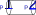
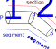
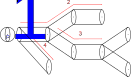
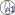
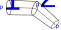
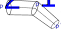

Specification
=============
Description of how MorphIO sees morphologies. MorphIO supports :ref:`.asc <specification-neurolucida>` (Neurolucida),
`.h5`_ (H5 version 1) and `.swc`_ extensions. A morphology is represented as a soma with neurites. Either soma or
neurites can be absent. Neurite is a tree of sections. Section is composed of segments where segment is made of points.
Lets start describing them from the smallest to the biggest entity.

Point
-----
A point is an array of three numbers **[X, Y, Z]** where X, Y, Z are Cartesian coordinates of position.
A point always has a diameter associated with it.

Segment
-------
A segment consists of two consecutive points(`Point`_) belonging to the same section(`Section`_).

Section
-------

A section is a series of one or more segments. Each section has a type associated with it. The type shows what part of
the neuron a section represents. The type can of the following: axon, soma, basal dendrite, apical dendrite or
custom dendrite. `Section API <cpp/doxygen_Section.html>`_.

The first and the last point of section must be of the following combinations:

1. starting point, forking point
2. forking point, end point
3. forking point, forking point
4. starting point, end point

Starting point is the first point of a section without parent inside the section. Forking point is the last point of a section that has
multiple children. End point is the last point of a section without children. For more details on section's parent and
children see `Neurite`_. The above combinations are marked with their corresponding number at the image below.

Neurite
-------

A neurite is an out-tree of sections(`Section`_). The tree structure implies the following:

* Section can have only one parent (another section).
* Section can have an arbitrary number of children (other sections).
* It exists a root section for the neurite.
* The structure is oriented : all its edges point away from the root.
* No cycles are present in the structure.

A section without parent is called a root section. A section with parent must have its first point to be a duplicate
of the last point of its parent.

Section ordering
****************
In MorphIO each section is identified by an ID. By default, the section IDs will correspond to
the order of section appearance while performing a depth-first traversal on every neurites. The
neurite order is the order of appearance in the file. Alternatively, the NRN simulator way of
ordering section can be used by specifying the flag ``morphio::Option::NRN_ORDER`` when opening
the file. In the NRN simulator, the soma which is considered as a section (contrary to MorphIO)
is placed first and then neurites are sorted according to their type.

The order is the following:

0. Soma
1. Axon
2. Basal
3. Apical

Section with only one child section
***********************************
Prior to version 3.0.0, when a section had a single child section (aka unifurcation), the child section would be merged
with its parent when reading or writing the file. Since version 3.0.0, merging does not happen when reading. Yet
writing of such sections is not allowed for SWC, and will cause an exception because SWC does not support single child
sections. Call ``removeUnifurcations`` method of `mut::Morphology <cpp/doxygen_mut::Morphology.html>`_ to merge them.

SWC IDs ordering
****************
There is no special constraint about the IDs as long as the parent ID of each point is defined. IDs don't need to be
consecutive nor sorted, and the soma does not need to be the first point.

Soma
----
Soma is a series of one or more points. Soma is not a neurite. MorphIO implements Soma specification from
`NeuroMorpho`_, and recognizes several kinds of soma format. `Soma API <cpp/doxygen_Soma.html>`_.

No Soma
*******
MorphIO can read correctly a file without a soma. The soma type of such file will be ``SOMA_UNDEFINED``.

Single point Soma
*****************

If a soma is composed of only one point, it will be treated as a sphere with the center in this point, and the radius
defined for this point. The type of such soma is ``SOMA_SINGLE_POINT``.

Two point Soma
**************
Only SWC is allowed to have two point Soma.

SWC
^^^

Soma is a cylinder with those two points as centers of the cylinder's bases. A point in this case defines a circle for
the cylinder's base. The type of such soma is ``SOMA_CYLINDERS``.

H5, ASC
^^^^^^^
MorphIO does not raise an exception when reading two point Soma. However accessing ``.surface`` property of such soma
will raise an exception. It's up to the user to define the meaning of such soma. The type of such soma is
``SOMA_UNDEFINED``.

Three point Soma
****************
Interpretation of three point soma differs among formats.

H5, ASC
^^^^^^^
Soma is represented the same as `Soma with 4 and more points`_.

SWC
^^^
Three point Soma can have different interpretations under this format.

**`NeuroMorpho`_ standard**

.. image:: images/swc/three_pt.svg
   :scale: 100 %
   :alt: soma two point

If soma is made of 3 points, where all points have almost the same X,Z coordinates and diameter, then the soma is
expected to follow the `NeuroMorpho`_ standard. In this standard A 3-points soma is
represented as a cylinder along the Y-axis. The first point describe the coordinate of the cylinder
center. Its radius represent the length AND radius of the cylinder. X and Z coordinates of
second and third points must be identical to those of first point. Y coordinate of second (resp.
third) point represents the bottom (resp. top) of the cylinder. Thus, it must have the value Y-R
(resp. Y+R) where Y is the Y coordinate of first point and R the radius. The type of such soma is
``SOMA_NEUROMORPHO_THREE_POINT_CYLINDERS``.

**Soma sequential cylinders**

If three point Soma does not conform to `NeuroMorpho`_ then it is treated as a stack of consecutive `conical frustums`_.
Each point describes coordinates and radius of a disk. Each frustums is formed by 2 consecutive disks.
The type of such soma is ``SOMA_CYLINDERS``.

Bifurcating Soma
****************

The only allowed bifurcation point in Soma is its root point. An error is thrown if any other soma point is bifurcating.

Multiple Soma
*************
Multiple somas are not supported

Soma with 4 and more points
***************************

SWC
^^^
Soma is treated as sequential cylinders. The type of it is ``SOMA_CYLINDERS``.

H5, ASC
^^^^^^^
ASC and H5 being the text and binary representation of the same format, they obey to the same specification.
Such soma is represented as a soma contour. The type of it is ``SOMA_SIMPLE_CONTOUR``.
Even if it is almost never the case in practice, contours are meant to be in the XY plane. Accessing ``.surface``
property of such soma type will raise an exception. It's up to the user to define surface of such somas.

In ASC, soma points are characterized by an S-expression starting with the tag "CellBody". In H5, soma points
are characterized by "structure" with type equal 1.

..

   :warning: MorphIO does not support ASC files with multiple CellBody tags. MorphIO does not support H5 with multiple
        "structure" entries with type equal 1. Simply saying soma that is split among multiple sections is not supported
        in those formats.

Sub-cellular structures
-----------------------
SWC does not support any sub-cellular structures. H5 and ASC support some, please see the following
for more details.

Spines
******
SWC and H5 do not support spines. ASC files containing files will be read correctly. However
spines data are not handled by MorphIO and spine information will be lost when writing to disk.

Mitochondria
************
SWC and ASC do not support mitochondria. Mitochondria can be read and written to disk using the H5
format. See :ref:`mitochondria-readme` for more details about the mitochondria API.

Custom annotations
******************
Custom annotations are not supported.

.. _`.h5`: https://developer.humanbrainproject.eu/docs/projects/morphology-documentation/0.0.2/h5v1.html
.. _`.swc`: http://www.neuronland.org/NLMorphologyConverter/MorphologyFormats/SWC/Spec.html
.. _`NeuroMorpho`: http://neuromorpho.org/SomaFormat.html
.. _`conical frustums`: http://mathworld.wolfram.com/ConicalFrustum.html
